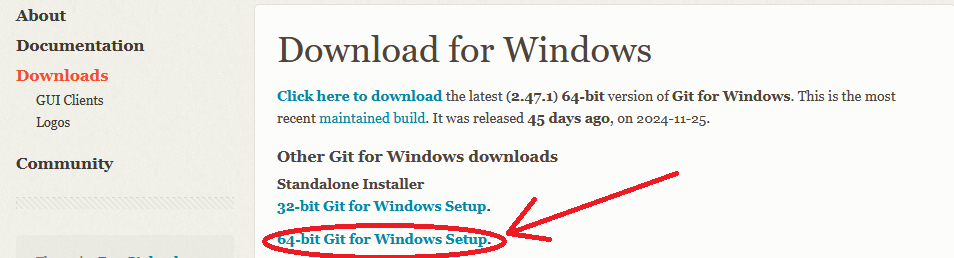
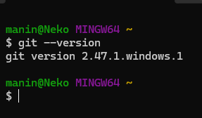

# PHP Repository for BTech CSE Batch IV, Year-2
A PHP Repository for the students of BTech CSE, Year-2, Semester-IV, Batch-IV of Swami Vivekananda University, Barrackpore
## How to install
To install this repository in your machine, follow the given steps:
- Download [Git CLI tool](https://git-scm.com/downloads/win) in your machine
    
    PS: If you are having issues, please consult sir or watch a [YouTube video](https://www.youtube.com/watch?v=JgOs70Y7jew).
<br>

- To verify if Git installed properly or not, search for Git Bash in search and type this command
    ```bash
        git --version
    ```
    If it worked, you should have *something* like
    <br>
    

<br>

- Change directory to htdocs folder
    Assuming XAMPP is installed in C directory
    ```bash
        cd c: && cd xampp/htdocs/
    ```

<br>

- Clone the repository to your machine
    ```bash
        git clone https://github.com/mayukh14Qf/PHP_SVU_B4.git
    ```
<br>

- Change into the directory
    ```bash
        cd PHP_SVU_B4
    ```
<br>

- Open VSCode(or any editor of your choice)
    ```bash
        code .
    ```
<br>

- Start coding!

## How to sync
To sync your repository with the most recent changes, follow the given steps:

- Open Git Bash and navigate to PHP_SVU_B4 folder
    ```bash
        cd c: && cd xampp/htdocs/PHP_SVU_B4
    ```
<br>

- Pull all the recent changes from GitHub
    ```bash
        git pull
    ```
<br>

- Congratulations! Your local repository is now synchronized!
